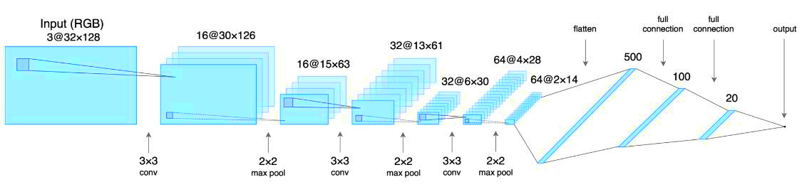
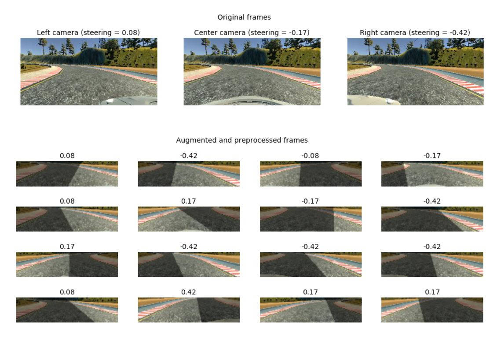

# Behavioral Cloning
###### - by NK Zou
  
#### The goals / steps of this project are the following:  
* Use the simulator to collect data of good driving behavior  
* Build, a convolution neural network in Keras that predicts steering angles from images  
* Train and validate the model with a training and validation set  
* Test that the model successfully drives around track one without leaving the road  
* Summarize the results with a written report  
  
---
  
# Rubric Points

### 1- Required Files 
#### Are all required files submitted?
#### The submission includes a model.py file, drive.py, model.h5 and a writeup report.
  
* model.py - load data and preprocess it on the fly, in batch size portions to feed into model.  
* model.h5 - model weights, containing a trained convolution neural network.  
* drive.py - implements autonomous mode in simulator, run with model.h5 (and model.json).
* writeup - summarization of the results.

### 2- Quality of Code  
### 2.1- Is the code functional?
##### The model provided can be used to successfully operate the simulation.
  
* Input ' python drive.py model.h5 ' into terminal to run this model.

### 2.2- Is the code usable and readable?
#### The code in model.py uses a Python generator, if needed, to generate data for training rather than storing the training data in memory. The model.py code is clearly organized and comments are included where needed.
  
* I used a generator to generate data for trainning model. It named generator() in model.py.

### 3- Model Architecture and Training Strategy
### 3.1- Has an appropriate model architecture been employed for the task?
#### The neural network uses convolution layers with appropriate filter sizes. Layers exist to introduce nonlinearity into the model. The data is normalized in the model.
  
  
* This figure is a model architecture from NVIDIA. I modified it as 3 convolutional layers + 3 fully connected layers since I don't need a complicated model for this project.
   
```  
model.add(convolutional.Convolution2D(16, 3, 3, input_shape=(32, 128, 3), activation='relu'))  
model.add(pooling.MaxPooling2D(pool_size=(2, 2)))  
model.add(convolutional.Convolution2D(32, 3, 3, activation='relu'))  
model.add(pooling.MaxPooling2D(pool_size=(2, 2)))  
model.add(convolutional.Convolution2D(64, 3, 3, activation='relu'))  
model.add(pooling.MaxPooling2D(pool_size=(2, 2)))  
model.add(core.Flatten())  
model.add(core.Dense(500, activation='relu'))  
model.add(core.Dropout(.5))  
model.add(core.Dense(100, activation='relu'))  
model.add(core.Dropout(.25))  
model.add(core.Dense(20, activation='relu'))  
model.add(core.Dense(1))  
model.compile(optimizer=optimizers.Adam(lr=1e-04), loss='mean_squared_error')  
```  

### 3.2- Has an attempt been made to reduce overfitting of the model?
#### Train/validation/test splits have been used, and the model uses dropout layers or other methods to reduce overfitting.
   
* I have use split function and dropout layers in the model trainning.  
  
```  
train_data, valid_data = model_selection.train_test_split(df, test_size=.2)  
  
model.add(core.Flatten())  
model.add(core.Dense(500, activation='relu'))  
model.add(core.Dropout(.5))  
model.add(core.Dense(100, activation='relu'))  
model.add(core.Dropout(.25))  
```    

### 3.3- Have the model parameters been tuned appropriately?
#### Learning rate parameters are chosen with explanation, or an Adam optimizer is used.

```
import pandas as pd
from sklearn import model_selection
df = pd.io.parsers.read_csv('driving_log.csv')
train_data, valid_data = model_selection.train_test_split(df, test_size=.2)
print(len(train_data))
print(len(valid_data))
```
* The number of epochs is 20, the batch size of both train_gen and validation_gen is 128 since I created almost 22000 images as data via train model in simulator. I used 17403 images per training epoch and 4351 images for validation. I chosen used Adam optimizer with 1e-4 learning rate.

### 3.4- Is the training data chosen appropriately?
#### Training data has been chosen to induce the desired behavior in the simulation (i.e. keeping the car on the track).
  
* Keep vehicle on the track on autonomous model.

### 4- Architecture and Training Documentation
### 4.1- Is the solution design documented?
#### The README thoroughly discusses the approach taken for deriving and designing a model architecture fit for solving the given problem.
  
* I have discussed the model architecture from section 3.1 to section 3.3.

### 4.2- Is the model architecture documented?
##### The README provides sufficient details of the characteristics and qualities of the architecture, such as the type of model used, the number of layers, the size of each layer. Visualizations emphasizing particular qualities of the architecture are encouraged.
  
* I have discussed the model architecture from section 3.1 to section 3.3. 

### 4.3- Is the creation of the training dataset and training process documented?
#### The README describes how the model was trained and what the characteristics of the dataset are. Information such as how the dataset was generated and examples of images from the dataset should be included.
  
* The driving simulator would save frames from three front-facing "cameras", recording data from the car's point of view; as well as various driving statistics like throttle, speed and steering angle. I am use camera data as model input and expect it to predict the steering angle in the [-1, 1] range.  
* Total 3 of camera positions: left, center and right. We only use the central camera while driving, but still need to use left and right cameras data during training steering angle correction.  
```  
cameras = ['left', 'center', 'right']
camera = np.random.randint(len(cameras)) if augment else 1
cameras_steering_correction = [.25, 0., -.25]
angle = data.steering.values[i] + cameras_steering_correction[camera]
```  
* I decrease the brightness of a frame to create a random vertical shadow to make the actual shadows on the road.  
```  
h, w = image.shape[0], image.shape[1]  
[x1, x2] = np.random.choice(w, 2, replace=False)  
k = h / (x2 - x1)  
b = - k * x1  
for i in range(h):  
    c = int((i - b) / k)  
    image[i, :c, :] = (image[i, :c, :] * .5).astype(np.int32)  
```  
* I cut out the top and bottom portions of the image for the vertical shift during preprocessing, and choosing the amount of frame to crop at random should increase the ability of the model to generalize.  
```  
top = int(random.uniform(.325, .425) * image.shape[0])  
bottom = int(random.uniform(.075, .175) * image.shape[0])  
image = image[top:-bottom, :]  
```   
* I crop top and bottom of the image and resize to a shape of the model expects 32×128×3, the scaling pixel values to [0, 1].
```  
image = skimage.transform.resize(image, (32, 128, 3))  
```  
* I flip half of the frames horizontally and change the sign of the steering angle for each batch.  
```  
flip_indices = random.sample(range(x.shape[0]), int(x.shape[0] / 2))  
x[flip_indices] = x[flip_indices, :, ::-1, :]  
y[flip_indices] = -y[flip_indices]  
```  
  
  
### 5- Simulation
### Is the car able to navigate correctly on test data?
#### No tire may leave the drivable portion of the track surface. The car may not pop up onto ledges or roll over any surfaces that would otherwise be considered unsafe (if humans were in the vehicle).
  
[Completed Project Video](https://twitter.com/samurai_robot/status/832115430298750976)   
  
### [Track Two] Suggestions to Make Your Project Stand Out!
##### The simulator contains two tracks. To meet specifications, the car must successfully drive around track one. Track two is more difficult. See if you can get the car to stay on the road for track two as well.
  
[Challenge Project Video](https://twitter.com/samurai_robot/status/832116301589946369)
